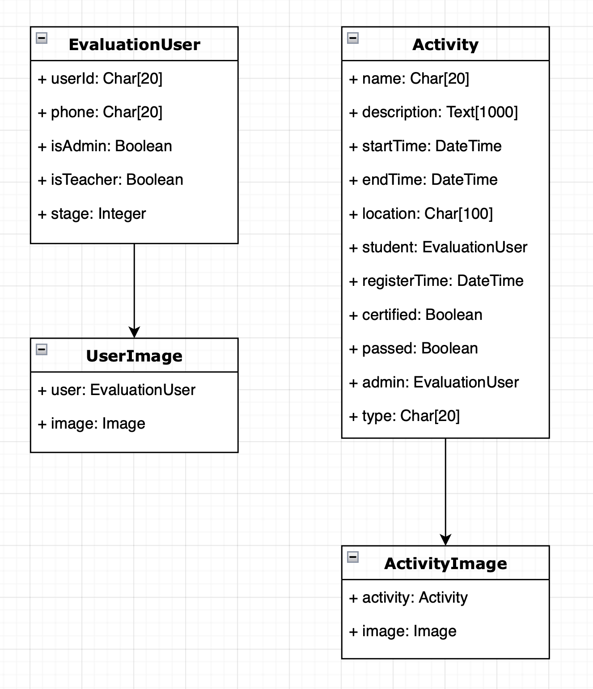

# 学生党员评价量化考核系统API文档
## 说明
- 本文档为学生党员评价量化考核系统的API文档
- 本文档中的请求URL均为相对路径
- 本文档中的请求参数和返回参数均为JSON格式
- 本文档中的请求参数中的`userId`均为学生学号，`adminId`均为管理员工号
- 本文档中的请求参数中的`phone`均为手机号
- 本文档中的请求参数中的`type`均为活动类型
- 本文档中的请求参数中的`stage`均为党员发展阶段
- 本文档中的请求参数中的`passed`均为是否通过
- 本文档中的请求参数中的`certified`均为是否审核
- 本文档中的请求参数中的`isTeacher`均为是否为教师
- 本文档中的请求参数中的`isAdmin`均为是否为管理员
### 实体类定义
| 学生党员 | 管理员 | 活动 | 活动图片 | 用户图片 |
| :------: | :----: | :--: | :------: | :----: |
| userId | adminId | name | activity | user |
| username | username | description | image | image |
| phone | phone | startTime | | |
| score_test1 | | endTime | | |
| stage | | location | | |
| isTeacher | | student | | |
| isAdmin | | registerTime | | |
| | | certified | | |
| | | passed | | |
| | | admin | | |
| | | type | | |



## 1. 用户登录
### 1.1 用户登录
#### 请求URL
- `POST` /api/student_login/
#### 请求参数
| 参数名 | 参数类型 | 是否必须 | 说明 |
| :----: | :------: | :------: | :--: |
| studentId | string | 是 | 学生学号 |
| password | string | 是 | 密码 |
#### 返回参数
| 参数名 | 参数类型 | 说明 |
| :----: | :------: | :--: |
| status | bool | 是否成功 |
| data | object | 返回数据 |
| message | string | 返回信息 |
#### 返回示例
```json
{
    "status": true,
    "data": {
        "studentId": "2018000000",
        "username": "张三",
        "phone": "18888888888"
    },
    "message": "登录成功"
}
```
#### 错误情况
```json
// 密码错误
{
    "status": false,
    "message": "密码错误"
}
// 用户不存在
{
    "status": false,
    "message": "用户不存在"
}
```
### 1.2 用户注册
#### 请求URL
- `POST` /api/student_register/
#### 请求参数
| 参数名 | 参数类型 | 是否必须 | 说明 |
| :----: | :------: | :------: | :--: |
| studentId | string | 是 | 学生学号 |
| username | string | 是 | 用户名 |
| password | string | 是 | 密码 |
| phone | string | 是 | 手机号 |
#### 返回参数
| 参数名 | 参数类型 | 说明 |
| :----: | :------: | :--: |
| status | bool | 是否成功 |
| message | string | 返回信息 |
#### 返回示例
```json
{
    "status": true,
    "message": "注册成功"
}
```
#### 错误情况
```json
// 注册失败
{
    "status": false,
    "message": "注册失败"
}
```

### 1.3 用户更新
#### 请求URL
- `POST` /api/student_update/
#### 请求参数
| 参数名 | 参数类型 | 是否必须 | 说明 |
| :----: | :------: | :------: | :--: |
| userId | string | 是 | 学生学号 |
| username | string | 是 | 用户名 |
| phone | string | 是 | 手机号 |
| stage | string | 是 | 党员发展阶段 |
#### 返回参数
| 参数名 | 参数类型 | 说明 |
| :----: | :------: | :--: |
| status | bool | 是否成功 |
| message | string | 返回信息 |
#### 返回示例
```json
{
    "status": true,
    "message": "更新成功"
}
```
#### 错误情况
```json
// 更新失败
{
    "status": false,
    "message": "更新失败"
}
```
### 1.4 用户修改密码
#### 请求URL
- `POST` /api/change_password/
#### 请求参数
| 参数名 | 参数类型 | 是否必须 | 说明 |
| :----: | :------: | :------: | :--: |
| userId | string | 是 | 学生学号 |
| oldPassword | string | 是 | 旧密码 |
| newPassword | string | 是 | 新密码 |
#### 返回参数
| 参数名 | 参数类型 | 说明 |
| :----: | :------: | :--: |
| status | bool | 是否成功 |
| message | string | 返回信息 |
#### 返回示例
```json
{
    "status": true,
    "message": "修改成功"
}
```
#### 错误情况
```json
// 密码错误
{
    "status": false,
    "message": "密码错误"
}
// 用户不存在
{
    "status": false,
    "message": "用户不存在"
}
```

### 1.5 用户登出
#### 请求URL
- `GET` /api/logout/
#### 返回参数
| 参数名 | 参数类型 | 说明 |
| :----: | :------: | :--: |
| status | bool | 是否成功 |
| message | string | 返回信息 |
#### 返回示例
```json
{
    "status": true,
    "message": "用户登出成功"
}
```
#### 错误情况
```json
// 用户未登录
{
    "status": false,
    "message": "还没有登录"
}
```
## 2. 管理员登录
### 2.1 管理员登录
#### 请求URL
- `POST` /api/admin_login/
#### 请求参数
| 参数名 | 参数类型 | 是否必须 | 说明 |
| :----: | :------: | :------: | :--: |
| adminId | string | 是 | 管理员工号 |
| password | string | 是 | 密码 |
#### 返回参数
| 参数名 | 参数类型 | 说明 |
| :----: | :------: | :--: |
| status | bool | 是否成功 |
| message | string | 返回信息 |
#### 返回示例
```json
{
    "status": true,
    "message": "登录成功"
}
```
#### 错误情况
```json
// 非管理员
{
    "status": false,
    "message": "非管理员"
}
// 密码错误
{
    "status": false,
    "message": "密码错误"
}
// 管理员不存在
{
    "status": false,
    "message": "管理员不存在"
}
```

### 2.2 管理员注册
#### 请求URL
- `POST` /api/admin_register/
#### 请求参数
| 参数名 | 参数类型 | 是否必须 | 说明 |
| :----: | :------: | :------: | :--: |
| adminId | string | 是 | 管理员工号 |
| username | string | 是 | 用户名 |
| password | string | 是 | 密码 |
| phone | string | 是 | 手机号 |
#### 返回参数
| 参数名 | 参数类型 | 说明 |
| :----: | :------: | :--: |
| status | bool | 是否成功 |
| message | string | 返回信息 |
#### 返回示例
```json
{
    "status": true,
    "message": "注册成功"
}
```
#### 错误情况
```json
// 注册失败
{
    "status": false,
    "message": "注册失败"
}
```
## 3. 活动管理
### 3.1 提交活动
#### 请求URL
- `POST` /api/create_activity/
#### 请求参数
| 参数名 | 参数类型 | 是否必须 | 说明 |
| :----: | :------: | :------: | :--: |
| name | string | 是 | 活动名称 |
| description | string | 是 | 活动描述 |
| startTime | string | 是 | 开始时间 |
| endTime | string | 是 | 结束时间 |
| location | string | 是 | 活动地点 |
| studentId | string | 是 | 学生学号 |
| type | string | 是 | 活动类型 |
#### 返回参数
| 参数名 | 参数类型 | 说明 |
| :----: | :------: | :--: |
| status | bool | 是否成功 |
| data | object | 返回数据 |
| message | string | 返回信息 |
#### 返回示例
```json
{
    "status": true,
    "data": {
        "activityId": 1
    },
    "message": "提交成功"
}
```
#### 错误情况
```json
// 提交失败
{
    "status": false,
    "message": "提交失败"
}
```

### 3.2 提交活动图片
#### 请求URL
- `POST` /api/post_activity_image/
#### 请求参数
| 参数名 | 参数类型 | 是否必须 | 说明 |
| :----: | :------: | :------: | :--: |
| activityId | int | 是 | 活动ID |
| image | file | 是 | 活动图片 |
#### 返回参数
| 参数名 | 参数类型 | 说明 |
| :----: | :------: | :--: |
| status | bool | 是否成功 |
| message | string | 返回信息 |
#### 返回示例
```json
{
    "status": true,
    "message": "提交成功"
}
```
#### 错误情况
```json
// 提交失败
{
    "status": false,
    "message": "提交失败"
}
```

### 3.3 获取活动列表
#### 请求URL
- `POST` /api/get_activities_list/
#### 请求参数
| 参数名 | 参数类型 | 是否必须 | 说明 |
| :----: | :------: | :------: | :--: |
| studentId | string | 是 | 学生学号 |
| startTime | string | 是 | 开始时间 |
| endTime | string | 是 | 结束时间 |
| certified | string | 是 | 是否审核 |
| passed | string | 是 | 是否通过 |
| adminId | string | 是 | 审核人工号 |
#### 返回参数
| 参数名 | 参数类型 | 说明 |
| :----: | :------: | :--: |
| status | bool | 是否成功 |
| data | object | 返回数据 |
| message | string | 返回信息 |
#### 返回示例
```json
{
    "status": true,
    "data": [
        {
            "model": "evaluation.activity",
            "pk": 1,
            "fields": {
                "name": "活动1",
                "description": "活动描述",
                "startTime": "2021-01-01 00:00:00",
                "endTime": "2021-01-01 00:00:00",
                "location": "活动地点",
                "description": "活动描述",
                "type": "活动类型",
                "passed": false,
                "certified": false,
                "admin": null,
                "registerTime": "2021-01-01 00:00:00"
            }
        }
    ],
    "message": "获取活动列表成功"
}
```
#### 错误情况
```json
// 获取失败
{
    "status": false,
    "message": "获取活动列表失败"
}
```

### 3.4 获取活动图片
#### 请求URL
- `POST` /api/get_activity_images/
#### 请求参数
| 参数名 | 参数类型 | 是否必须 | 说明 |
| :----: | :------: | :------: | :--: |
| activityId | int | 是 | 活动ID |
#### 返回参数
| 参数名 | 参数类型 | 说明 |
| :----: | :------: | :--: |
| status | bool | 是否成功 |
| data | object | 返回数据 |
| message | string | 返回信息 |
#### 返回示例
```json
{
    "status": true,
    "data": [
        {
            "model": "evaluation.activityimage",
            "pk": 1,
            "fields": {
                "activity": 1,
                "image": "media/activity/1.jpg"
            }
        }
    ],
    "message": "获取成功"
}
```
#### 错误情况
```json
// 获取失败
{
    "status": false,
    "message": "获取失败"
}
```

### 3.5 删除活动
#### 请求URL
- `POST` /api/delete_activity/
#### 请求参数
| 参数名 | 参数类型 | 是否必须 | 说明 |
| :----: | :------: | :------: | :--: |
| activityId | int | 是 | 活动ID |
#### 返回参数
| 参数名 | 参数类型 | 说明 |
| :----: | :------: | :--: |
| status | bool | 是否成功 |
| message | string | 返回信息 |
#### 返回示例
```json
{
    "status": true,
    "message": "删除成功"
}
```
#### 错误情况
```json
// 删除失败
{
    "status": false,
    "message": "删除失败"
}
```

### 3.6 查看活动
#### 请求URL
- `POST` /api/check_activity/
#### 请求参数
| 参数名 | 参数类型 | 是否必须 | 说明 |
| :----: | :------: | :------: | :--: |
| adminId | string | 是 | 审核人工号 |
| activityId | int | 是 | 活动ID |
| passed | string | 是 | 是否通过 |
#### 返回参数
| 参数名 | 参数类型 | 说明 |
| :----: | :------: | :--: |
| status | bool | 是否成功 |
| data | object | 返回数据 |
| message | string | 返回信息 |
#### 返回示例
```json
{
    "status": true,
    "data": [
        {
            "model": "evaluation.activity",
            "pk": 1,
            "fields": {
                "name": "活动1",
                "description": "活动描述",
                "startTime": "2021-01-01 00:00:00",
                "endTime": "2021-01-01 00:00:00",
                "location": "活动地点",
                "description": "活动描述",
                "type": "活动类型",
                "passed": true,
                "certified": true,
                "admin": 1,
                "registerTime": "2021-01-01 00:00:00"
            }
        }
    ],
    "message": "审核成功"
}
```
#### 错误情况
```json
// 已经审核过了
{
    "status": false,
    "message": "已经审核过了"
}
// 审核失败
{
    "status": false,
    "message": "审核失败"
}
```

## 4. 学生管理
### 4.1 删除学生
#### 请求URL
- `POST` /api/delete_student/
#### 请求参数
| 参数名 | 参数类型 | 是否必须 | 说明 |
| :----: | :------: | :------: | :--: |
| studentId | string | 是 | 学生学号 |
#### 返回参数
| 参数名 | 参数类型 | 说明 |
| :----: | :------: | :--: |
| status | bool | 是否成功 |
| message | string | 返回信息 |
#### 返回示例
```json
{
    "status": true,
    "message": "删除成功"
}
```
#### 错误情况
```json
// 删除失败
{
    "status": false,
    "message": "删除失败"
}
```

### 4.2 获取学生列表
#### 请求URL
- `GET` /api/get_students_list/
#### 返回参数
| 参数名 | 参数类型 | 说明 |
| :----: | :------: | :--: |
| status | bool | 是否成功 |
| data | object | 返回数据 |
| message | string | 返回信息 |
#### 返回示例
```json
{
    "status": true,
    "data": [
        {
            "model": "evaluation.evaluationuser",
            "pk": 1,
            "fields": {
                "userId": "2018000000",
                "username": "张三",
                "phone": "18888888888",
                "score_test1": 1,
                "stage": "发展阶段",
                "isTeacher": false,
                "isAdmin": false
            }
        }
    ],
    "message": "获取学生列表成功"
}
```
#### 错误情况
```json
// 获取失败
{
    "status": false,
    "message": "获取学生列表失败"
}
```

## 5. 图片管理
### 5.1 提交用户图片
#### 请求URL
- `POST` /api/post_user_image/
#### 请求参数
| 参数名 | 参数类型 | 是否必须 | 说明 |
| :----: | :------: | :------: | :--: |
| userId | string | 是 | 学生学号 |
| image | file | 是 | 用户图片 |
#### 返回参数
| 参数名 | 参数类型 | 说明 |
| :----: | :------: | :--: |
| status | bool | 是否成功 |
| message | string | 返回信息 |
#### 返回示例
```json
{
    "status": true,
    "message": "提交成功"
}
```
#### 错误情况
```json
// 提交失败
{
    "status": false,
    "message": "提交失败"
}
```

### 5.2 获取用户图片
#### 请求URL
- `POST` /api/get_user_image/
#### 请求参数
| 参数名 | 参数类型 | 是否必须 | 说明 |
| :----: | :------: | :------: | :--: |
| userId | string | 是 | 学生学号 |
#### 返回参数
| 参数名 | 参数类型 | 说明 |
| :----: | :------: | :--: |
| status | bool | 是否成功 |
| data | object | 返回数据 |
| message | string | 返回信息 |
#### 返回示例
```json
{
    "status": true,
    "data": [
        {
            "model": "evaluation.userimage",
            "pk": 1,
            "fields": {
                "user": 1,
                "image": "media/user/1.jpg"
            }
        }
    ],
    "message": "获取成功"
}
```
#### 错误情况
```json
// 获取失败
{
    "status": false,
    "message": "获取失败"
}
```

## 6. 导出Excel
### 6.1 导出Excel
#### 请求URL
- `POST` /api/export_excel/
#### 请求参数
| 参数名 | 参数类型 | 是否必须 | 说明 |
| :----: | :------: | :------: | :--: |
| studentId | string | 是 | 学生学号 |
#### 返回参数
| 参数名 | 参数类型 | 说明 |
| :----: | :------: | :--: |
| status | bool | 是否成功 |
| message | string | 返回信息 |
#### 返回示例
```json
{
    "status": true,
    "message": "导出成功"
}
```
#### 错误情况
```json
// 导出失败
{
    "status": false,
    "message": "导出失败"
}
```

## 7. 其他
### 7.1 获取CSRF Token
#### 请求URL
- `GET` /api/get_token/
#### 返回参数
| 参数名 | 参数类型 | 说明 |
| :----: | :------: | :--: |
| status | bool | 是否成功 |
| data | string | CSRF Token |
#### 返回示例
```json
{
    "status": true,
    "data": "CSRF Token"
}
```
#### 错误情况
```json
// 获取失败
{
    "status": false,
    "data": "获取失败"
}
```

### 7.2 判断是否登录
#### 请求URL
- `GET` /api/is_login/
#### 返回参数
| 参数名 | 参数类型 | 说明 |
| :----: | :------: | :--: |
| status | bool | 是否成功 |
| data | object | 返回数据 |
| message | string | 返回信息 |
#### 返回示例
```json
{
    "status": true,
    "data": {
        "userId": "2018000000",
        "username": "张三",
        "phone": "18888888888",
        "score_test1": 1,
        "stage": "发展阶段",
        "isTeacher": false,
        "is_admin": false
    },
    "message": "已经登录了"
}
```
#### 错误情况
```json
// 还没有登录
{
    "status": false,
    "message": "还没有登录"
}
```
