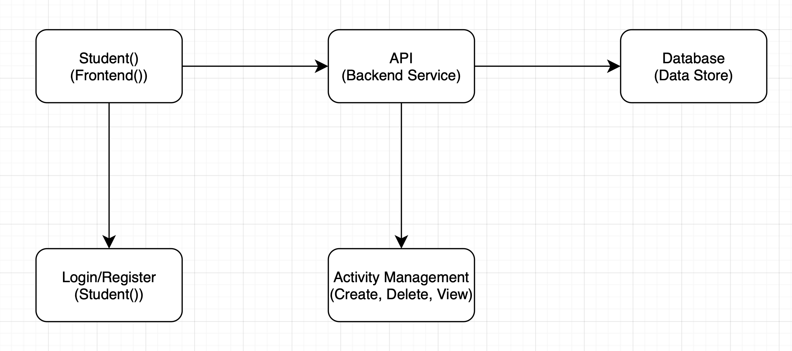
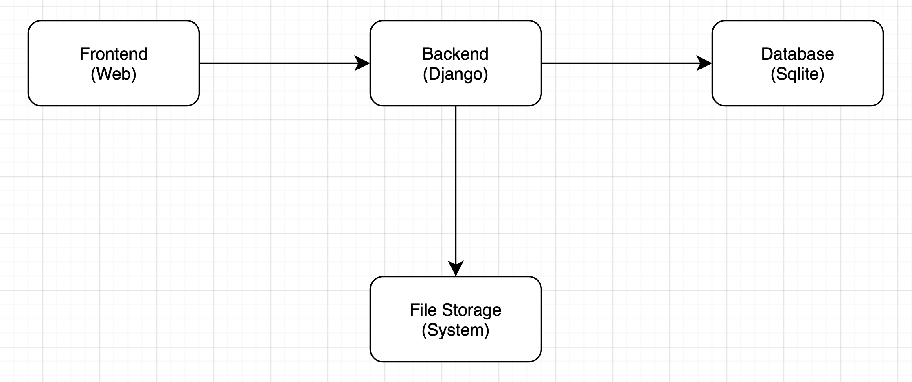
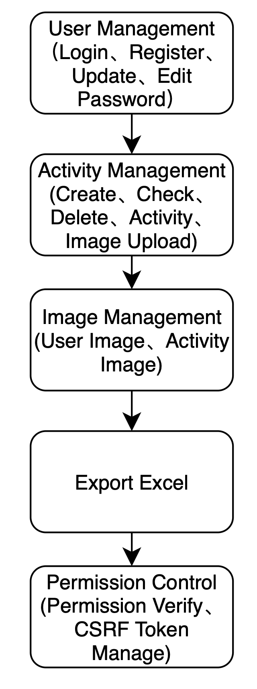

# 学生党员评价量化考核系统设计文档
## 项目介绍
需求分析说明书用于明确学生党员评价量化考核系统的功能需求、性能需求和用户需求，指导后续系统的开发、测试和部署。
### 项目背景
党的十九大以来要求落实到发展党员全过程各环节，确保新发展党员政治合格、素质过硬。

而大学生党员是党员组成里的一大部分，对于学校发展大学生党员有重要意义。学生党员的考核是对学生党员的一种考核方式，通过考核可以了解学生党员的思想、作风、学习、工作等情况，对学生党员进行激励和约束，使学生党员更好地发挥党员的先锋模范作用。

本系统旨在通过信息化手段，提高高校学生党员考核的效率和透明度。传统考核方式以纸质和手工记录为主，存在效率低、主观性强的问题，已无法适应现代化的高校党建管理需求。
### 项目目标
本系统的目标是为高校学生党员考核提供一个信息化的解决方案，实现以下目标：
- 提高学生党员考核的效率和透明度
- 降低学生党员考核的成本
- 方便学生党员查看自己的考核情况以及支部对学生党员的评价
- 为学生党员提供一个公平、公正的考核环境
- 为学校党建工作提供数据支持

系统框图

### 功能需求

#### 学生党员
- 登录：学生党员通过学号和密码登录系统
- 查看和编辑个人信息：学生党员可以查看和编辑自己的基本信息

对于每一个用户都有一个`userId`，`phone`，`isAdmin`，`isTeacher`，`score_test1`，`stage`字段，其中`userId`是用户的学号，`phone`是用户的电话号码，`isAdmin`是用户是否是管理员，`isTeacher`是用户是否是老师，`score_test1`是用户的考核分数，`stage`是用户的党员阶段。

- 查看考核情况：学生党员可以查看自己的考核情况
- 查看支部评价：学生党员可以查看支部对自己的评价
- 上传活动材料：学生党员可以上传活动材料

#### 支部管理员
- 登录：管理员通过管理员号和密码登录系统
- 查看和编辑管理员信息：管理员可以查看和编辑管理员的基本信息
- 查看支部信息：管理员可以查看支部的基本信息
- 查看学生党员信息：管理员可以查看学生党员的基本信息
- 查看学生党员的考核情况：管理员可以查看学生党员的考核情况
- 查看学生党员的活动材料：管理员可以查看学生党员上传的活动材料

简易架构图

### 模块划分
本系统主要包括以下模块：
- 用户管理（UserManagement）
- 活动管理（ActivityManagement）
- 图片管理（ImageManagement）
- Excel导出 （Export Excel）
- 权限管理（PermissionManagement）

模块划分图

